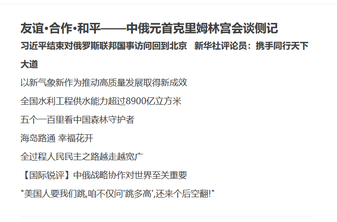
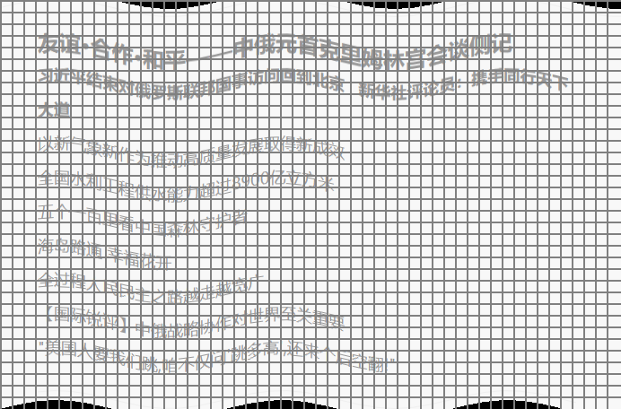
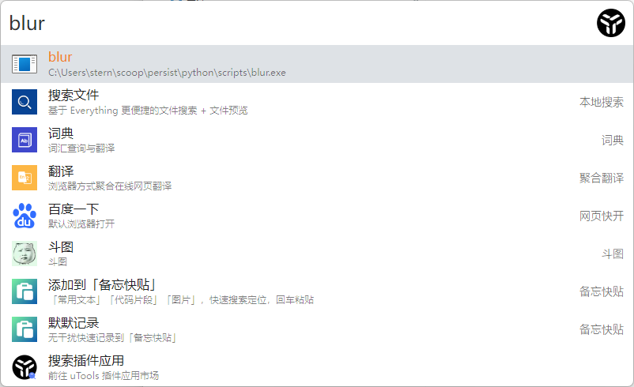

# Blur

Just clone the code and run "make", it will install "blur" command into your system.

Just copy any image or text into clipboard and run blur, it will convert image to blured version

# Example

## image

## text

友谊·合作·和平——中俄元首克里姆林宫会谈侧记 

伖谊·匼莋·啝岼——狆皒沅渞尅里姆啉営浍談側汜 

## 

I prefer to use utool to run

